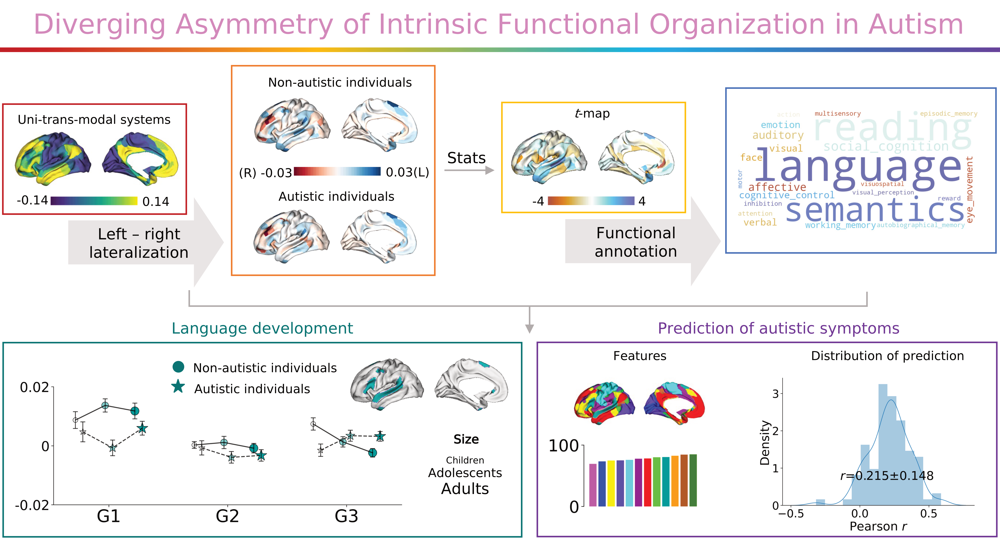

**Bin Wan, Seok-Jun Hong, Richard AI Bethlehem, Dorothea L Floris, Boris C Bernhardt, Sofie L Valk**. *Molecular Psychiatry* (2023). 
  
https://www.nature.com/articles/s41380-023-02220-x  
**Preprint version**  
https://www.biorxiv.org/content/10.1101/2023.04.05.535683v1
# How to run the codes
## Activate the enviornment  
- `$ conda activate autism`  
- `$ cd [working directory]/autism/`

## Clean the data according to the requirements
- Here, I deleted the subjects with bad quality of MRI
- And remove IQ<70 or without IQ information
- Keep all the boys
- Age from 5-40 years
- Head motion with mean_FD<0.3mm
- Finally there are 5 datasites survived including 283 subjects.

## Prepare the phenotype dataframe  
- ID, site, group, age, FIQ, ADOS_social, ADOS_communication, ADOS_rrb, mean_FD  
`$ python scripts/data_sort.py`  
The **output** here is: 'abide_demo_sort.csv' 

## Process the fMRI data from time series to FC to gradients  
- **FC**   
**Input**: '../data/data_autism/1_fc/'  
`$ python scripts/data_process_fc.py`  
**Output**: 'results/fc/'    
- **Gradients**  
**Input**: 'results/fc/'  
`$ python scripts/data_process_grad_HCP_template.py`  
**Output**: 'results/grad/'

## Statics  
`$ jupyter-lab`  
  1. Demographics  
  **click** the *'scripts/vis_basic_stas.ipython'* (Table S1)
  2. Comparisons between ASD and controls and age effcts
  **click** the *'scripts/vis_main.ipython'* (Figures 1, 2, S1, S2, S8, S9 and Tables S2, S3, S4, S5, S6)
  3. Enrichment analyses  
  **click** the *'scripts/vis_enrichment.ipynb'* (Figures 3, S6, S7, S8, and Table S7)
  4. Machine learning prediction  
  `$ python scripts/prediction.py`  
  **Output**: 'results/prediction/'  
  then in ipython notebook, **click** the *'scripts/vis_EN_ML.ipynb'* (Figures 4, S9, and S10)
  5. Global signal regression  
  **Input:** '../data/data_autism/1_fc/'  
  `$ python scripts/data_process_GSR.py`  
  **Output**: 'results/GSR/'
  6. FIQ, head motion removal  
  **click** the *'scripts/vis_main_fIQ_HeadMotion.ipynb'*

PS: Bulit-in functions are shown in *'scripts/func_utils.py'*

## Main dependencies based on Python 3.9
- BrainSpace
- BrainStat
- Scikit-learn
- SciPy
- neuroCombat

## Acknowdgements
- Autism Brain Imaging Data Exchange
- Human Connectome Project
- Funding sources from **Boris C. Bernhardt** & **Sofie L. Valk**
